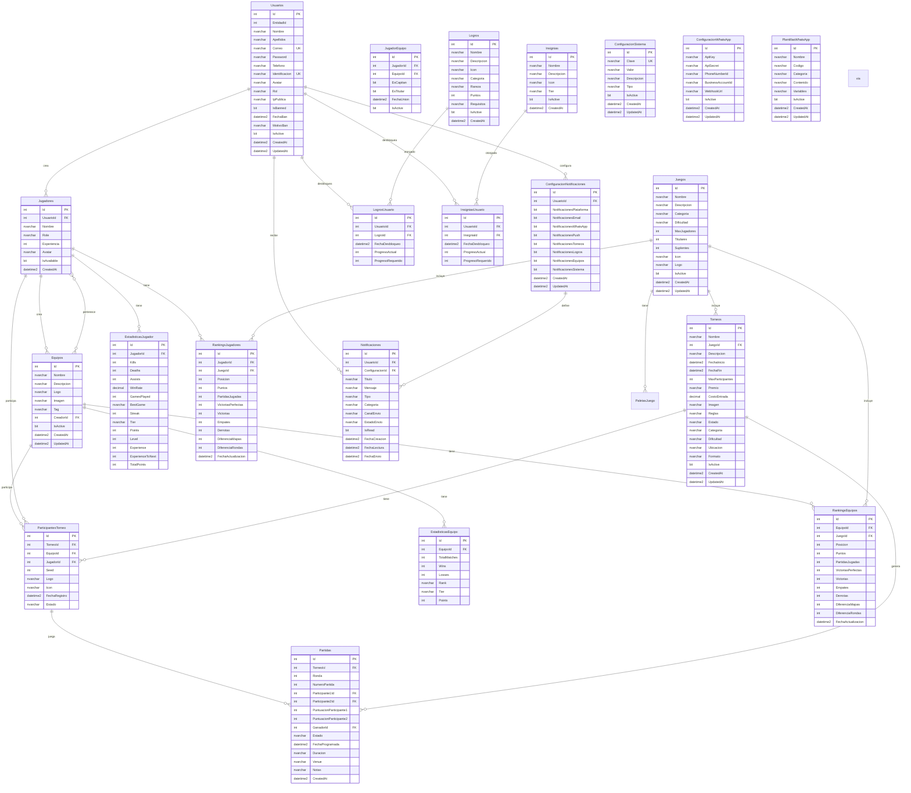
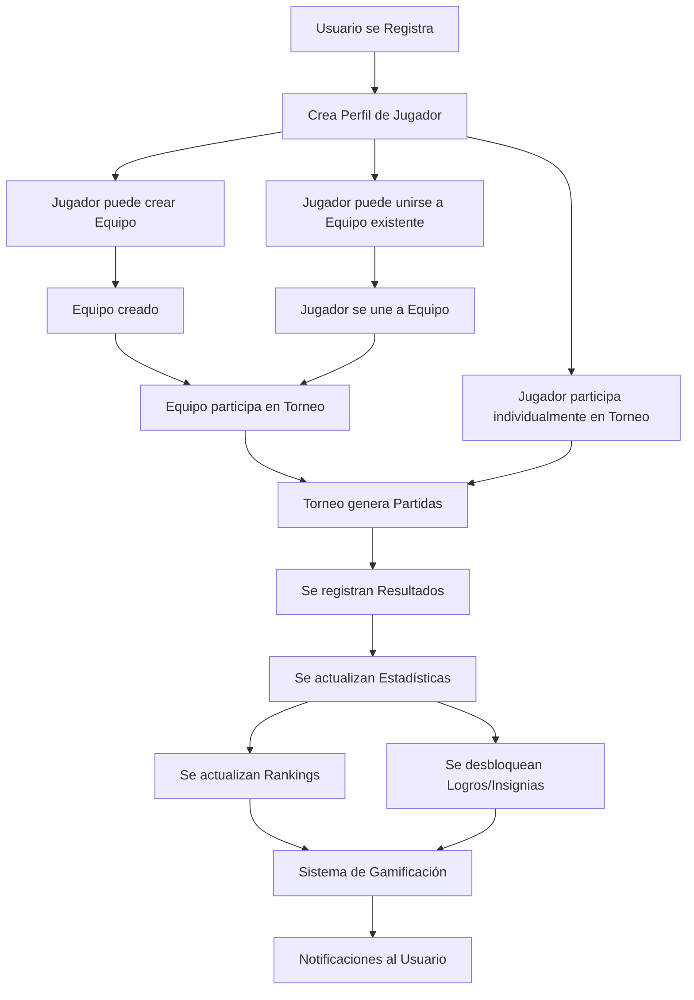
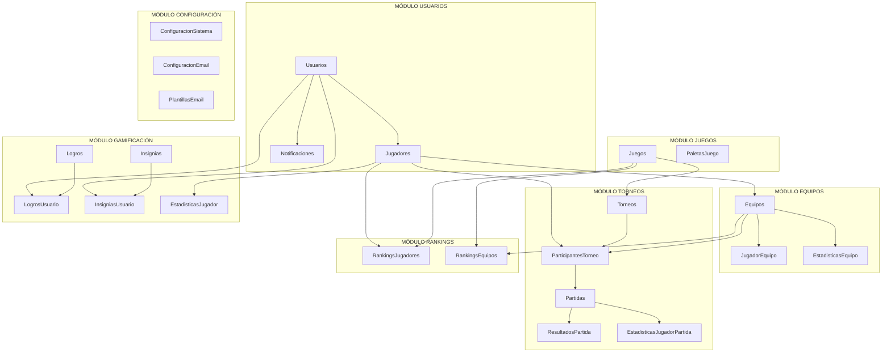

# Diagrama de Base de Datos - World Gaming (CORREGIDO)

## Diagrama ER (Entity Relationship) - Flujo Lógico

## Diagrama de Flujo del Sistema

## Diagrama de Módulos del Sistema

## Resumen de la Estructura Corregida

### ✅ **Problemas Solucionados:**

1. **Dependencia Circular Eliminada**: Ya no hay dependencia circular entre `Equipos` y `Jugadores`
2. **Relación Muchos a Muchos Correcta**: Se usa `JugadorEquipo` para manejar la relación
3. **Flujo Lógico Implementado**: El orden de creación es coherente
4. **Integridad Referencial**: Todas las foreign keys están correctamente definidas

### 📊 **Estadísticas de la Base de Datos:**

- **Total de Tablas**: 27 tablas
- **Tablas Principales**: 9 tablas
- **Tablas de Torneos**: 5 tablas
- **Tablas de Gamificación**: 4 tablas
- **Tablas de Rankings**: 2 tablas
- **Tablas de Configuración y Notificaciones**: 7 tablas
- **Total de Índices**: 28 índices
- **Total de Vistas**: 6 vistas
- **Total de Procedimientos**: 7 procedimientos
- **Total de Triggers**: 4 triggers

### 🔄 **Flujo de Datos Principal:**

1. **Usuario** → **Jugador** (1:1)
2. **Jugador** → **Equipo** (Muchos:Muchos via JugadorEquipo)
3. **Equipo/Jugador** → **Torneo** (via ParticipantesTorneo)
4. **Torneo** → **Partidas** (1:Muchos)
5. **Partidas** → **Estadísticas** (1:Muchos)
6. **Estadísticas** → **Rankings** (1:1)
7. **Actividades** → **Logros/Insignias** (Muchos:Muchos)

### 🎯 **Características Clave:**

- ✅ **Sin dependencias circulares**
- ✅ **Relaciones lógicas correctas**
- ✅ **Integridad referencial mantenida**
- ✅ **Flujo de datos coherente**
- ✅ **Optimización con índices**
- ✅ **Procedimientos almacenados útiles**
- ✅ **Vistas para consultas complejas**
- ✅ **Triggers para integridad**
- ✅ **Control de estado activo en relaciones**
- ✅ **Soporte para equipos y jugadores individuales**
- ✅ **Sistema de notificaciones multicanal**
- ✅ **Configuración de WhatsApp integrada**
- ✅ **Plantillas de mensajes dinámicas**
- ✅ **Sistema de baneo por IP**
- ✅ **Campos adicionales en torneos**

### 🔧 **Nuevas Funcionalidades Agregadas:**

#### **Sistema de Notificaciones Multicanal:**
- **ConfiguracionNotificaciones**: Permite a los usuarios configurar dónde recibir notificaciones (plataforma, email, WhatsApp, push)
- **Notificaciones mejoradas**: Incluye canal de envío, estado de envío y fecha de envío
- **Integración con configuración**: Las notificaciones se vinculan con las preferencias del usuario

#### **Configuración de WhatsApp:**
- **ConfiguracionWhatsApp**: Almacena credenciales de la API de WhatsApp Business
- **PlantillasWhatsApp**: Permite crear y gestionar plantillas de mensajes con variables dinámicas
- **Sistema de plantillas**: Soporte para categorías y variables personalizables

#### **Sistema de Seguridad:**
- **Campos de baneo en Usuarios**: IP pública, estado de baneo, fecha y motivo
- **Índices de seguridad**: Optimización para consultas de baneo por IP
- **Procedimientos de gestión**: Funciones para banear/desbanear usuarios

#### **Mejoras en Torneos:**
- **CostoEntrada**: Campo para definir costos de participación
- **Imagen**: Campo para imágenes de torneos
- **Reglas**: Campo para reglas específicas del torneo
- **IsActive**: Control de estado activo del torneo
